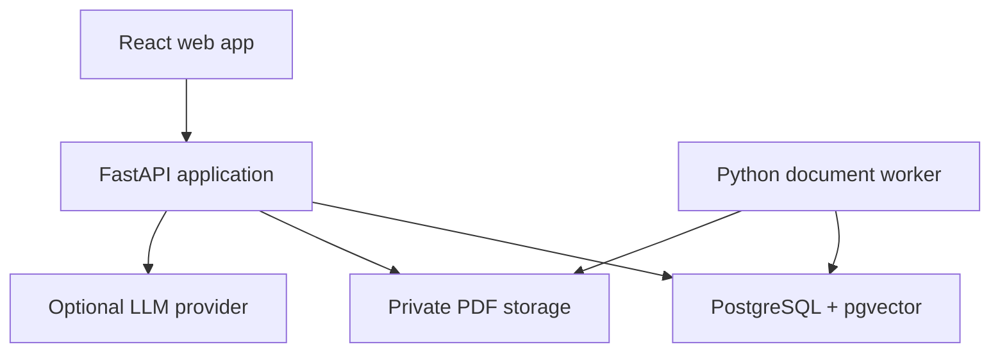
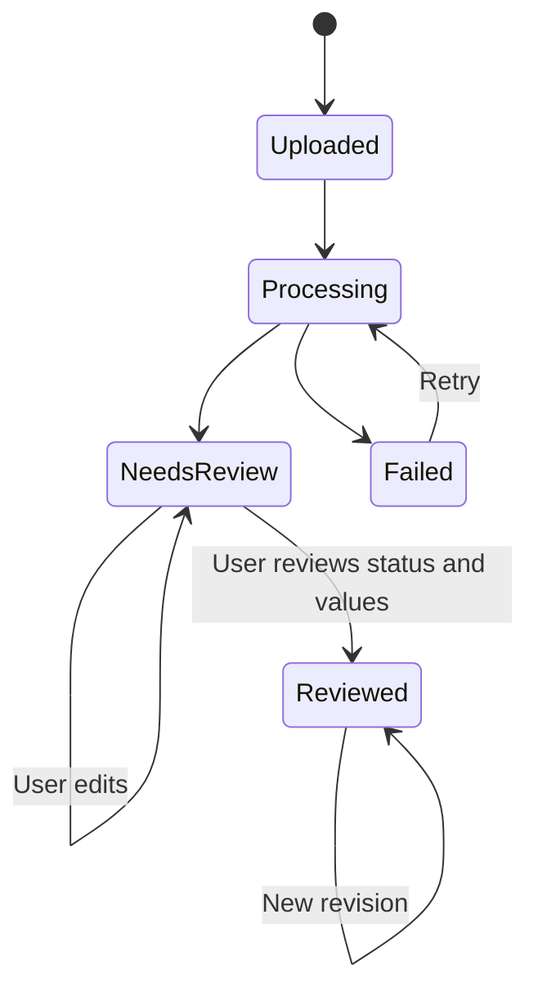

# SupplyLens — MVP Architecture

**Status:** Proposed implementation design
**Date:** 28 September 2026
**Audience:** The engineer building the first release
**Read with:** [SupplyLens MVP Definition](SupplyLens-MVP-Definition-v0.1.md). The separate private formula guide defines Mulligan's actual calculations; this document defines how software can execute configurable policies without embedding those rules in the public repository.

## 1. The decision in one minute

Build one repository containing a React web app, a Python API, and a Python document worker. The API and worker are two processes using the same modular backend code. PostgreSQL holds reviewed purchase cases, document drafts, jobs, policy versions, and search passages. Private file storage holds the original PDFs. A local storage adapter and Docker Compose make the complete product runnable on a development computer.

The system works from upload through confirmation, estimates, reports, and document search without an LLM key. Automatic extraction supports digital PDFs with selectable text. Image-only or scanned PDFs are preserved, marked unsupported for automatic extraction, and routed to manual review. Local embeddings improve document search when resources allow. An optional LLM only suggests uncertain fields, writes evidence-grounded answers, or maps a question to an approved metric request. It never approves a purchase or performs financial calculations.

**The business rule that governs the model:** The first bill a user reviews and confirms as a purchase supplies the values used for that purchase, even when the supplier never issues an invoice. A later invoice or other document is linked as evidence. Matching documents do not create a second purchase or change estimates. Differences are shown for explicit review; a user can make a new purchase revision if warranted. A pre-order can instead be reviewed as a plan and used for a provisional price scenario without being counted as a recorded purchase. No document implies payment, receipt of goods, stock on hand, or a sale.

This document refines the earlier MVP definition wherever its order/invoice examples might suggest invoice precedence. There is no invoice precedence.

## 2. Scope and architectural rules

The first release supports multiple private business workspaces, with one or more signed-in operators in each workspace, supplier purchase PDFs, a product catalog, versioned calculation policies, purchase-only reports, document search, and bounded optional AI assistance. Each business owns its data and configures its own private object-storage account/bucket. Operators within a business share that business's documents; users from another business cannot access them. The public demonstration uses synthetic or safely anonymized data. Payments, stock receipt, inventory, sales, and demand forecasting are later domains.

Keep these invariants visible in code and UI:

1. **Source versus decision:** A PDF and its extracted draft are evidence. A reviewed case revision records the user's classification and values. Each important value retains its origin.
2. **One purchase case:** Multiple linked documents may describe one intended or recorded purchase. Reports aggregate reviewed cases by their explicit business status, not uploaded PDFs.
3. **No inferred payment or stock:** “Confirmed purchase value” is not “cash spent”; potential selling price is not realized revenue or profit.
4. **Money has a currency and provenance:** Never sum unlike currencies implicitly. Use decimal arithmetic, explicit rate inputs, and an explicit rounding policy.
5. **Estimates are reproducible:** Keep the exact purchase revision, policy version, inputs, intermediate values, output, and warnings. Editing a purchase or policy produces a new estimate; it does not rewrite history.
6. **The model cannot decide:** Parser, matching, and LLM outputs are suggestions. A user confirms the purchase, product match, and policy.
7. **Useful without AI services:** No external LLM credential is required for the complete purchase workflow or keyword document search.

## 3. System shape



| Component | Responsibility | Important boundary |
| --- | --- | --- |
| Web app | Upload, PDF review, corrections, product matching, policy editor, reports, and questions. | Displays suggestions and confirmed values separately; sends no PDF directly to an LLM. |
| API | Auth, validation, purchase confirmation, policy evaluation, reports, search, and job status. | Owns business decisions and read-only metric definitions. |
| Worker | PDF validation, digital extraction, parsing, indexing, embedding, retries. | Writes drafts and job results, never confirms purchases. |
| PostgreSQL | Transactional records, job leases, full-text index, and optional vectors. | Source of truth for structured purchase facts; PDFs are stored separately. |
| PDF storage | Original PDF bytes. | Private, referenced by opaque storage keys; not exposed as public URLs. |
| Optional AI adapter | Structured suggestions and cited answer composition. | Off by default, with limited excerpts and schema-validated responses. |

One backend package is a **modular monolith**. The API and worker may run in separate containers for resource isolation, but they share domain types and database migrations. No message broker or microservice network is needed for this workload. Document extraction and indexing run in the worker rather than in an API background task. The job table is an implementation choice for the initial scale; a dedicated queue can replace it later without changing purchase logic.

### Module dependency rule

`documents`, `purchases`, `catalog`, `policies`, `reports`, and `assistant` expose application services and typed interfaces. Database repositories, PDF tools, storage, and LLM clients implement those interfaces at the edges. The policy evaluator receives typed inputs; it does not import PDF, HTTP, ORM, or model code. The assistant reads approved purchase queries and document passages; it cannot call purchase-confirmation or policy-publishing commands.

## 4. Core data model

Use stable IDs, database constraints, timestamps, and explicit migrations. The following are logical entities, not a final column-by-column schema.

| Entity | Key fields and relationships | Why it exists |
| --- | --- | --- |
| `BusinessWorkspace` / `WorkspaceMembership` | Business identity, member users and roles, storage configuration reference. | Defines the business data boundary and which signed-in operators can act for it. |
| `Supplier` | Name, normalized identifiers, aliases. | A supplier identity can appear under different printed names. |
| `Document` | Owning `workspace_id`, supplier, type as printed or classified, reference, date, currency, SHA-256, storage key, processing status, optional `purchase_id`. | One immutable source PDF owned by a business workspace; document type is descriptive, not a requirement for confirmation. |
| `DocumentField` / `DocumentLine` | Extracted candidates, printed values, page and optional bounding box, extractor version, confidence or warning, user correction; line role (`product`, `charge`, or `other`). | Keep evidence and correction history separate from the purchase view. A handling fee is not a sellable line. |
| `Purchase` | Supplier, current reviewed revision ID, explicit business status (`planned`, `ordered`, or `purchase_recorded`). | One purchase case regardless of document count, including pre-orders used for planning. |
| `PurchaseRevision` / `PurchaseLine` | Reviewed header, monetary components, quantities, original supplier wording and codes, chosen source fields, product link, revision number, confirmer, time. | Immutable reviewed snapshot for reports and estimates. The business status belongs to the revision. |
| `Product` / `SupplierProduct` | Store name, SKU, category, supplier-specific identifiers and names, reviewed match. | Reuse the store catalog without erasing source descriptions. |
| `Policy` / `PolicyVersion` | Name, draft/published state, validated input schema, steps, output definitions, immutable published version. | Business-neutral configuration with historical reproducibility. |
| `Estimate` | Purchase revision, policy version, scenario inputs, intermediate steps, outputs, warnings, creation time. | Distinguish derived projections from document facts. |
| `ProcessingJob` | Kind, state, attempts, lease owner/expiry, next retry, error code, document ID. | Recover from worker failure without losing the upload. |
| `SearchPassage` | Document, page, ordered text/table context, text index, embedding/model version if available. | Ground document answers in retrievable evidence. |

An extraction candidate should carry a source such as `digital_parser`, `supplier_rule`, `llm_suggestion`, or `user_entry`. For a reviewed value, keep a reference to the selected document field where possible; a manually supplied value has its own note and actor. Do not store a single ambiguous `total` when the PDF has merchandise, freight, tax, and grand total: model named amounts and reconcile them. The PDF examples show why: one supplier document explicitly calls itself a pre-order, while another includes a freight/handling row alongside products and an MSRP column separate from net purchase price. The parser must classify these, and the user must confirm the document's business role.

### Linking a later document

1. Duplicate detection checks exact file hash and suggests possible matches using supplier, printed reference, date, amounts, and products. A possible match is **never auto-merged**.
2. The user links the new document to the existing purchase. Compare its header, line identifiers, quantities, unit amounts, discounts, fees, and totals with the confirmed revision where they are comparable.
3. If it agrees, mark it `matched_supporting_evidence`. The purchase and estimates stay as they were.
4. If it differs, mark it `needs_reconciliation` with a field-level difference list. The prior revision remains active until the user accepts specific changes and confirms a new revision.
5. An unrelated bill creates a separate purchase. A document cannot be counted in two purchases; relinking requires an explicit action and audit entry.

The first confirmed purchase bill may itself be called an invoice. The software must not depend on that label. A pre-order stays `planned` or `ordered` until a user explicitly records it as a purchase, with or without a later invoice. Comparison must tolerate different document layouts, missing fields, partial quantities, and rounding differences rather than pretending that two PDFs are byte-for-byte equivalent.

### Reporting semantics

Default supplier and product purchase reports use **one current reviewed revision per case with status `purchase_recorded`**. Show planned or ordered amounts in separate views; do not add them to recorded purchase totals. Sum amounts only within the same currency, and keep document-level order/invoice views separate from purchase aggregates. Show document type, business status, and source links for inspection. A later revision changes current reports while historical revisions and prior estimates remain available. The MVP can report amounts recorded as purchases; actual paid amount needs future payment events. Product cost and possible selling price are estimates under a policy, not realized earnings.

## 5. Document workflow



The diagram shows the useful user-visible document states. Internally, jobs record finer steps such as `extracting`, `parsing`, and `indexing`. A reviewed case has its separate business status (`planned`, `ordered`, or `purchase_recorded`) and may have a later supporting document in `needs_reconciliation`. Processing, review, and business status are distinct.

**Upload:** Require a valid PDF signature as well as content type; set byte and page limits; compute a hash; save original bytes privately; create a document and a job in one recoverable operation. If file storage succeeds and the database write fails, delete the orphan or reconcile it during maintenance. A client retry should not silently make a second purchase.

**Extract:** Inspect each page for usable selectable text. Use `pdfplumber` for text, tables, and locations in supported digital PDFs and store page text with an extraction version. Low-quality tables remain uncertain suggestions. If the PDF is image-only or scanned, preserve it, set an explicit unsupported-automatic-extraction status, and let the user enter every required field manually.

**Parse and validate:** Start with a general parser and a small supplier-rule registry keyed by observable layout markers. Produce typed candidates for supplier, reference, currency, date, line descriptions, product codes, quantities, unit prices, discounts, fees, and totals. Classify rows as products, charges, or other text; preserve MSRP separately from the supplier's net unit price. Validate arithmetic with declared tolerances; never silently force a printed line or grand total to match. Mark missing or contradictory fields for review. LLM suggestions do not overwrite higher-trust user corrections.

**Review and confirm:** Show the PDF alongside editable candidate fields with page links. Require an explicit business status, supplier, a meaningful document date or an explicit unknown marker, currency for each amount, and reviewable product/charge lines. The exact field checklist can be tightened against the fixture set. Product matches and SKU/name suggestions are reviewed separately. Reviewing creates an immutable purchase-case revision in a transaction and invalidates no prior history. A planned pre-order can receive a provisional cost/price preview; it does not enter recorded purchase reports until the user changes its status explicitly.

**Index:** Create passages from pages, sections, and complete table row/heading context. An indexing failure should leave purchase review available. Reprocessing the same document and extractor version is idempotent; changed extractors make a new extraction run rather than rewriting confirmed facts. Update job progress in the database. The UI may use polling first and add server-sent events if progress needs to feel live.

**Worker recovery:** Claim one due job with a database lease and a bounded attempt count; release or extend the lease while working; retry transient failures with backoff; show permanent failures and a manual retry action. Make output writes idempotent using document ID and extraction/index version. A PostgreSQL queue fits the initial scale; if throughput grows, move the transport behind the job interface.

## 6. Product identity and suggestions

A purchase line always preserves the printed supplier name and code. A store product is a separate identity. Matching proceeds in this order: previously reviewed supplier-code mapping, exact product identifier, normalized name, then fuzzy candidates. Fuzzy matches need user acceptance; a low score should simply leave the line unmatched. Detect SKU collisions before saving.

Spanish product-name and SKU suggestions use configurable deterministic templates and dictionaries with a preview. The public repository ships only synthetic example rules. Supplier-specific mappings and Mulligan rules live in private configuration or private database records. Future catalog changes do not rewrite source documents or historical purchase lines.

## 7. Calculation policy engine

The public engine executes a **small, typed, versioned directed graph of steps**. The initial editor presents guided groups—inputs, allocation, conversion, cost, selling price, and rounding—while persisting the same general step representation. A business can define a policy from approved operations without writing Python or using an LLM to generate executable rules.

| Concept | Design |
| --- | --- |
| Inputs | Named values with type, unit/currency, source (`purchase`, `manual`, `scenario`), required flag, and validation range. Unknown values remain unknown. |
| Steps | References to earlier inputs or steps; bounded arithmetic, percentage, allocation by declared basis, currency conversion with an explicit rate, and rounding. Validate acyclic references and dimensional compatibility. |
| Outputs | Named estimates such as per-unit cost or suggested retail price, with clear currency, scope, and status. |
| Version | Draft can change; published policy version is immutable. A preview uses a draft without making it active. |
| Evaluation | Decimal arithmetic, explicit allocation remainder handling, explicit rounding stage, deterministic output and trace. Zero denominators and invalid rates fail clearly. |
| Missing data | Block the affected output or show a labeled provisional scenario with user-provided assumptions. Never invent an FX rate, weight, tax treatment, or fee. |

The private formula guide includes separate concepts for merchandise, shared supplier fees, courier, FX, import charges, tax treatment, margin, checkout costs, and later payment/stock/sales forecasting. The engine must support composition and traceability needed by the *MVP pricing subset*; it must not publish Mulligan's policy, hard-code its rates, or implement future event data merely because the guide describes those formulas. A private acceptance suite can load a private policy and check known examples. Public tests use invented values and synthetic documents.

To prevent double counting, an input charge has an identity and category; a policy preview should show which source charges are allocated and which remain unallocated. Each allocation checks that its distributed shares reconcile to the original charge after the policy's rounding rule. The engine records whether a result is a document fact, a manually supplied assumption, or a policy estimate. A change in an exchange-rate scenario creates a fresh estimate, not a changed historical purchase.

**Example with invented values:** A purchase has two lines and one shared USD 12 fee. A policy allocates that fee by each line's merchandise amount, adds each share to line cost, converts using a user-selected rate, and rounds a proposed price. The public engine defines the operations and stores the trace; the business policy determines the actual allocation, conversion, margin, and rounding choices.

## 8. Search, RAG, and metrics

### Document questions

The search service first filters by the selected document or allowed supplier/date set. It runs exact-term/full-text search and, if local embeddings are available, semantic search. It merges ranked candidates using a documented rank-fusion method, returns passages with document and page references, and includes nearby row headings when a passage is tabular. pgvector supports the vector half beside PostgreSQL full-text search; compare keyword-only, vector-only, and hybrid results on a small labeled question set before claiming an improvement.

Search works without an LLM. If the optional answer composer is enabled, it receives only retrieved passages and the user's question. It must cite the specific document/page it used, refuse unsupported claims, and allow the user to open the source. Store embedding model/version so reindexing can occur safely. If the local embedding model is unavailable or too resource-intensive for deployment, keyword search remains available.

### Purchase-data questions

The server exposes approved metric definitions such as `confirmed_purchase_value`, `quantity_by_product`, and `unit_price_history`, each with typed filters and currency semantics. Dashboard filters call these directly. An optional model can propose a JSON request for one approved metric and filter set; the server validates it against the schema and executes its own read-only query. Ambiguous time period, supplier, currency, or metric leads to clarification or an explicit breakdown. Never run generated SQL. A question mixing document wording and purchase metrics initially returns separate evidence and computed results or asks the user to narrow it.

The assistant module should have interfaces like `retrieve_passages`, `compose_answer`, and `interpret_metric_request`. Keep provider SDK details in adapters. A small LangChain integration can orchestrate the optional retrieval-and-compose path, but the application owns the search query, ranking, source citations, allowed metrics, and tests.

## 9. API and user experience contracts

These are route groups, not a frozen HTTP specification. Publish an OpenAPI contract and use typed request/response models.

| Route group | Example actions | UI surface |
| --- | --- | --- |
| `/documents` | Upload, list, read draft, get private PDF, retry processing, link to purchase, compare. | Upload queue and PDF review. |
| `/purchases` | Create/review revision, set business status, inspect history, filter recorded purchases and plans separately. | Purchase detail and history. |
| `/products` | Search, create, review supplier mapping, suggest name/SKU. | Product matching panel. |
| `/policies` | Edit draft, validate/preview, publish version, list estimates. | Guided policy editor and trace. |
| `/reports` | Approved purchase metrics and drill-down. | Supplier/product dashboards. |
| `/questions` | Document passages, optional cited answer, approved metric request. | Document and purchase question modes. |
| `/jobs` | State and progress, polling or events. | Processing indicator. |

The review screen is the central product experience: PDF on one side, extracted fields and validation findings on the other, with links to the source page. On a narrow screen the two views become stacked or switchable. The user explicitly chooses whether the record is a plan, an order, or a recorded purchase. A report row links back to its revision and source bill. Policy previews show each intermediate value, required assumptions, and why a result is provisional.

## 10. Repository layout and local setup

```text
supplylens/
  apps/
    web/                 # React + TypeScript + Vite
    backend/             # One Python package and two entry points
      src/supplylens/
        api/             # HTTP routes, auth, schemas
        worker/          # Job runner and processors
        documents/       # PDF/parser/review application logic
        purchases/       # Confirmation, revisions, reconciliation
        catalog/         # Products, matches, name/SKU suggestions
        policies/        # Typed policy validation and evaluation
        reports/         # Approved purchase metrics
        assistant/       # Retrieval and optional model adapters
        infrastructure/  # Database, file storage, provider adapters
      migrations/
      tests/
  fixtures/              # Synthetic PDFs and expected results only
  docs/                  # Architecture, decisions, API examples, evaluation
  infra/                 # Compose and deployment configuration
  compose.yaml
  README.md
```

This layout expresses boundaries without making every module a separate package. API and worker import the same domain services. Use a Python dependency lockfile, a JavaScript lockfile, pinned container images, a `.env.example` with dummy values, and migrations run explicitly. `docker compose up` should start web, API, worker, and a local PostgreSQL build with pgvector; seed only synthetic data. Keep real supplier PDFs, private formulas, credentials, and extracted real text out of Git, logs, test snapshots, and public CI artifacts.

## 11. Security, privacy, and failure behavior

- Require authentication for all private API routes before any real supplier data is used. A business workspace is the ownership boundary: its authorized operators share its documents, while other workspaces have no access. Store `workspace_id` on documents and all business-owned records, and scope every read, write, delete, search, and download-URL request to a workspace membership verified by the API. Do not treat an unguessable document ID as authorization.
- Resolve each workspace's object-storage configuration on the server. Construct/use that workspace's S3-compatible storage client for upload signing, verification, download signing, deletion, and worker access. Keep credentials in a secrets manager or equivalent protected configuration and store only a secret reference with workspace settings; never return credentials to the browser or persist them in plaintext application tables. Presigned URLs are short-lived bearer capabilities and must only be issued after workspace authorization.
- Validate PDF bytes, size, page count, and processing time. Treat supplier text as untrusted input, including prompt-injection attempts inside a PDF. Run extraction with bounded resources and no arbitrary shell interpolation.
- Use private storage and short-lived authenticated retrieval through the API. Encrypt transport, manage provider keys as secrets, and never expose them to the browser.
- LLM assistance is opt-in. Show when excerpts leave the application, minimize those excerpts, and log request metadata without raw private document text. Manual workflow remains available on provider failure.
- Never log full documents, prices, credentials, or user-entered private policies by default. Retain an audit trail for confirmation, revision, policy publication, linking, and manual retry.
- Back up the database **and** PDF objects together; a restored purchase must still have its source. Choose retention and deletion rules before using real business data in a hosted environment.
- A failed parser, embedding, or LLM step should preserve the original PDF and a usable status. Image-only or scanned PDFs must also retain the original and an explicit unsupported-automatic-extraction status. Confirmation of manually entered facts should be possible even when indexing is unavailable.

## 12. Verification and observable quality

| Risk | Verification |
| --- | --- |
| Wrong extracted amount or missing selectable-text line | Labeled digital PDF fixtures; compare field values and correction counts; inspect source-page links. Verify image-only or scanned PDFs are preserved and routed to manual review. |
| Duplicate purchase from bill plus invoice | Same-purchase link fixture; confirm reports count one recorded purchase and show both documents. |
| Pre-order counted as spent or recorded purchase | Pre-order fixture stays in plan/order reporting and produces only labeled provisional estimates until explicit promotion. |
| Freight row treated as sellable product | Invoice fixture separates handling charge from product lines and validates the document total. |
| Later document changes a price silently | Matching invoice leaves the revision/estimate unchanged; mismatch requires an explicit new revision. |
| Fee allocated twice or money rounded incorrectly | Policy unit tests with Decimal, allocation reconciliation, missing-input and multi-currency examples; private business examples outside the public repo. |
| Unsupported document answer | Labeled question/evidence set; compare keyword, semantic, hybrid retrieval and verify citations support the answer. |
| Model controls a query or business value | Reject arbitrary metric names, filters, SQL, policy edits, and confirmations in adversarial API tests. |
| Worker crash or repeated upload | Lease/retry and idempotence integration tests, storage cleanup/reconciliation. |
| AI dependence | Full browser flow with all external AI credentials absent and local embeddings disabled. |

CI runs formatting, type checking, backend tests, frontend tests, migrations on a clean database, and a small end-to-end upload-to-report path using synthetic files. Keep a small evaluation command that reports extraction accuracy, correction effort, retrieval hit quality, answer citation validity, runtime, and optional LLM cost on safe fixtures. Publish aggregate results and known failure cases in the README; do not claim AI improved the product until measured.

## 13. Deployment decision gate

Local development is concrete; hosting remains a measured choice. First measure digital extraction and embedding jobs on representative synthetic PDFs: peak RAM/CPU, job duration, storage size, and document-search latency. Then evaluate a provider against these requirements: persistent PostgreSQL with pgvector, private PDF storage and backups, an API process, a worker that can run long jobs, HTTPS/auth, and predictable cost. A free static frontend alone is insufficient for the full private workflow. A public demo can use synthetic data and a smaller worker configuration if the full stack is too expensive to keep online continuously.

Keep storage behind a `DocumentStore` interface (local disk for Compose, private object storage for hosting) and model generation behind a provider adapter. These are the main deployment substitutions. Do not make a hosting provider or public demo a prerequisite for local product verification.

## 14. Build order: vertical slices

1. **Repository skeleton:** Web/API/worker/DB Compose, migrations, health checks, CI, synthetic PDF fixture, architectural decision records.
2. **Document to reviewed case:** Upload, original storage, digital PDF extraction, editable review, manual entry, explicit plan/order/purchase status, and history. This is the first useful slice.
3. **Hard documents and reconciliation:** Supplier layout rules, explicit manual review for unsupported image-only documents, processing retries, duplicate suggestions, later-document linking, and difference review.
4. **Catalog and prices:** Reviewed product mapping, name/SKU suggestions, guided policy editor, policy versioning, transparent estimates, private policy acceptance examples.
5. **Reports:** One-purchase aggregation, supplier/product filters, currency-safe metrics, source drill-down.
6. **Document search and optional AI:** Full-text search, local embeddings, hybrid evaluation, cited answer generation, bounded extraction help, approved metric interpretation.
7. **Real-data readiness:** Authentication, workspace membership and data isolation, per-business storage configuration/client resolution, backups, load/resource measurements, safe public demo, operational README. Synthetic end-to-end development can precede this slice; do not upload or process real supplier data until it is complete.

Each slice should run end to end before adding the next. A useful initial PR is the repository skeleton plus a synthetic PDF upload that creates a processing job and an editable draft. Avoid building every table, screen, and AI feature upfront. The synthetic flow may run without authentication during development, but real supplier data requires authenticated, workspace-scoped API and storage access.

## 15. Decisions and open measurements

| Decision | Current choice | Revisit when |
| --- | --- | --- |
| Repository | Monorepo. | Independent teams or release cadence justify separation. |
| Backend shape | Modular Python package; API and worker processes. | Workload or ownership clearly demands services. |
| Purchase source | First reviewed bill marked `purchase_recorded`, regardless of document label. A pre-order remains a plan/order; a later matching invoice is evidence. | A real supplier case shows a different purchasing lifecycle. |
| Policy UX | Guided templates backed by typed reusable steps. | Private formula examples cannot be represented without unsafe complexity. |
| Jobs | PostgreSQL table with leases and retries. | Scale/operations warrant a broker. |
| Search | Exact text always; local vectors and rank fusion when available. | Evaluation or resource measurements favor a simpler path. |
| LLM | Opt-in adapter; disabled by default. | Measured correction savings and answer quality justify its cost. |
| Hosting | Deferred until extraction/embedding measurements. | Local MVP meets acceptance criteria. |

These are implementation choices, not claims that the product already works. Record a short ADR when evidence changes a choice.

## 16. References

- [SupplyLens MVP Definition](SupplyLens-MVP-Definition-v0.1.md) — product scope and success criteria.
- Private formula guide — separate business rules and acceptance examples; do not copy into the public repository.
- [FastAPI background tasks guidance](https://fastapi.tiangolo.com/tutorial/background-tasks/) — motivation for a separate worker for heavy processing.
- [PostgreSQL `SELECT` documentation](https://www.postgresql.org/docs/current/sql-select.html) — `SKIP LOCKED` queue-like use.
- [pgvector documentation](https://github.com/pgvector/pgvector#hybrid-search) — hybrid text and vector search.
